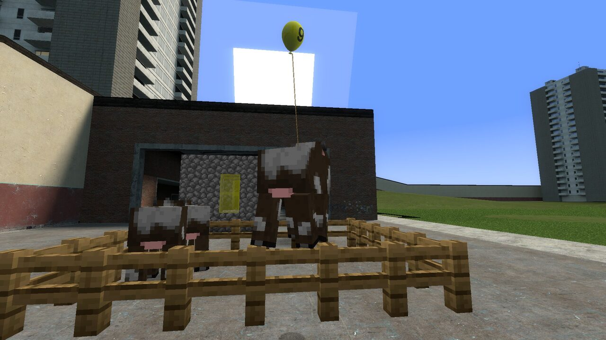
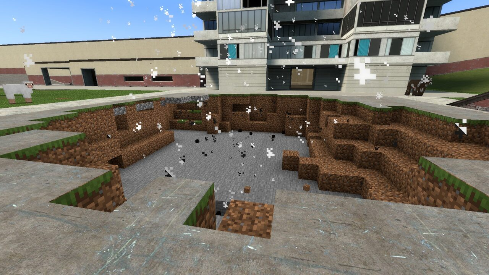
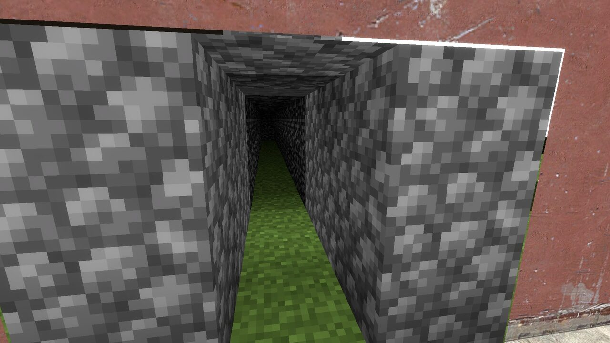
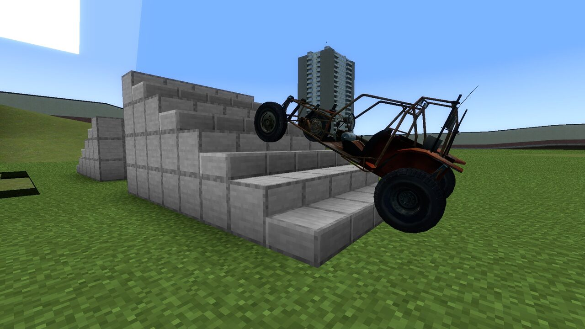
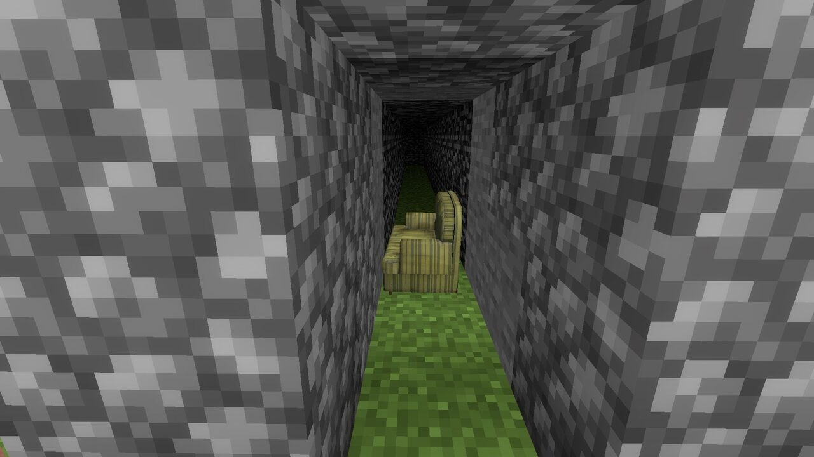

# Garry's Modcraft

**Play Garry's Mod as a Minecraft player.** You walk, dig, build and fight with a real Minecraft client, inside a
real Garry's Mod map, next to GMod players, props, NPCs and contraptions. Both games run at the same time and share
one world: Minecraft blocks show up in GMod, GMod props and maps are solid in Minecraft.

Linux (x86-64) only for now. Current release: **0.5.1** (see [CHANGELOG.md](CHANGELOG.md)).

| | |
|---|---|
|  |  |
|  |  |

## What you can do

- **Dig into any GMod map.** Mine through floors and walls; the hole is cut out of the map in GMod and sealed with
  block faces. Below the map there is a Minecraft world: void, flat ground, deep stone with ores, or real caves.
- **Build in both games.** Minecraft blocks, slabs, stairs, redstone and microblocks (covers, panels, posts) are
  drawn in GMod and solid for GMod props, vehicles, NPCs and players. Drive the jeep up a block ramp.
- **Mix physics and mobs.** Physgun a cow, rope a pig, throw a zombie, freeze a mob in mid-air. GMod NPCs fight
  Minecraft mobs; bullets, fire, explosions and falling props hurt them, with model-shaped hit boxes and headshots.
- **Ride GMod things.** Minecraft players are carried by moving props, lifts and trains, and can sit in vehicles.
- **Trade items across.** GMod weapons as Minecraft items, GMod props picked up as items and placed again,
  Minecraft blocks exported as AdvDupe2 dupes and props turned into blocks.
- **Wire it together.** Redstone talks to Wiremod and to map doors, buttons and triggers.
- **Map ground acts like its material.** Till GMod grass into farmland, plant on it, grow sugar cane on map sand.
- **Play together.** A dedicated GMod server plus a Minecraft server on the same machine; friends join with the
  launcher. GMod-only players see Minecraft players as normal players.

## Install (players)

You need Garry's Mod from Steam on the **x86-64 beta branch** (Properties → Betas), Minecraft Java with a Microsoft
account, and [Prism Launcher](https://prismlauncher.org/).

1. Download `gmodcraft-launcher.pyz` and `garrys-modcraft-<version>.zip` from the
   [releases](https://github.com/cheetahdotcat/garrys-modcraft/releases).
2. Run `python gmodcraft-launcher.pyz` (Arch/CachyOS: `sudo pacman -S tk` first).
3. In the launcher: install the bundle, add a server, press Play.

The launcher copies the GMod modules and addon into your GMod folder, sets up a "GmodCraft" Prism instance with
Fabric and the mod, and fetches a Java 25 runtime. Step-by-step guide and troubleshooting:
[docs/QUICKSTART.md](docs/QUICKSTART.md).

## Run a server

On a Linux x86-64 machine, with the release's `garrys-modcraft-<version>.zip` and `server_setup.sh`:

    bash server_setup.sh --bundle garrys-modcraft-<version>.zip --accept-eula

It installs the GMod dedicated server (SteamCMD, x86-64 branch) with the modules and addon and, on the **same
machine**, the Minecraft server (the two talk through shared memory), asks for the server and rcon passwords,
and writes `start.sh`, `stop.sh` and `status.sh` into `~/gmodcraft-server`. Forward **27015 UDP+TCP** and
**25565 TCP**. Admins get a control centre in the spawn menu (maps, world types and backups, difficulty, mob and
fire rules). Details: "For the server owner" in [docs/QUICKSTART.md](docs/QUICKSTART.md).

## How it works

The Minecraft client runs hidden next to GMod and is connected to it through shared memory (`/dev/shm`). Minecraft
does the moving, digging and building; GMod draws Minecraft's blocks, entities and HUD inside its own frame, with
depth against the map. GMod sends its map collision, props, NPCs and players to Minecraft, so Minecraft collides
with them. On a server, the GMod server and the Minecraft server are linked the same way and keep players, damage,
mobs and physics in sync. 1 block = 40 Source units.

## Build from source

`module/build.sh` builds the native modules (Steam Runtime SDK via podman), `cd fabric && ./gradlew build` the
Fabric mod (JDK 25).

| Folder | |
|---|---|
| `fabric/` | Minecraft 26.3 Fabric mod |
| `module/` | GMod binary modules (`gmcl_`/`gmsv_gmodcraft`, C++) |
| `addon/gmodcraft/` | GMod Lua addon |
| `protocol/` | Shared-memory protocol header (shared by C++ and Java) |
| `launcher/` | Player launcher (Python, Tk) |

## Status

Work in progress and played among friends: expect rough edges. Linux only (Windows and macOS later). Anti-cheat
is out of scope. Known issues and plans: [CHANGELOG.md](CHANGELOG.md).

## License

MIT. Derived from [SkyCraft](https://github.com/hawktuahs/SkycraftFork) (Skyrim + Minecraft, MIT,
`LICENSE.skycraft`), upstream commit `b0c8d88cffa8bab07bfbd4036bed4a9aef5695eb`.
